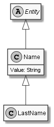

# LastName

## Generally

|||
|:-|:-|
|Description|An lastname for humans.|
|Namespace|DoofesZeug.Models.Specieses.Human|
|BaseClass|Name|
|SourceCode|[LastName.cs](../../../../DoofesZeug.Library/Src/Models/Specieses/Human/LastName.cs)|
|Example||

## Properties

### Declared

|Name|Type|Read|Write|DefaultValue|
|:---|:---|:--:|:---:|:-----------|

### Inherited

|Name|Type|Read|Write|DefaultValue|
|:---|:---|:--:|:---:|:-----------|
|Value|String|&#x2713;|&#x2713;|NULL|

## Attributes

- Description

## UML Diagram



## JSON Example

```json
"Mustermann"
```

