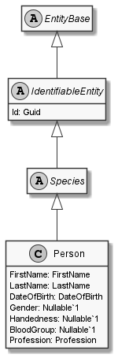

# Person

## Generally

|Property|Value|
|:-|:-|
|Description|An simplified person with an firstname, lastname, birthday and some other optional properties.|
|Namespace|DoofesZeug.Models.Specieses.Human|
|BaseClass|Species|
|SourceCode|[Person.cs](../../../../DoofesZeug.Library/Src/Models/Specieses/Human/Person.cs)|

---

## Properties

### Declared

|Name|Type|Read|Write|DefaultValue|
|:---|:---|:--:|:---:|:-----------|
|FirstName|[FirstName](../../Models/DoofesZeug.Models.Specieses.Human/FirstName.md)|&#x2713;|&#x2713;|NULL|
|LastName|[LastName](../../Models/DoofesZeug.Models.Specieses.Human/LastName.md)|&#x2713;|&#x2713;|NULL|
|Handedness|Handedness?|&#x2713;|&#x2713;|NULL|
|BloodGroup|BloodGroup?|&#x2713;|&#x2713;|NULL|
|Profession|[Profession](../../Models/DoofesZeug.Models.Specieses.Human.Professions/Profession.md)|&#x2713;|&#x2713;|NULL|

### Inherited

|Name|Type|Read|Write|DefaultValue|
|:---|:---|:--:|:---:|:-----------|
|DateOfBirth|[DateOfBirth](../../Models/DoofesZeug.Models.DateAndTime/DateOfBirth.md)|&#x2713;|&#x2713;|NULL|
|Gender|Gender?|&#x2713;|&#x2713;|NULL|
|Id|Guid|&#x2713;|&#x2713;|Guid.NewGuid()|

---

## Attributes

- Builder
- Description
- Example

---

## UML Diagram



---

## Code Example

```cs
namespace DoofesZeug.UnitTests.Functional.Builder
{
    [TestClass]
    public class TestPersonBuilder
    {
        [TestMethod]
        public void ExecuteTest()
        {
            Person person = PersonBuilder.New().
                WithDateOfBirth((01, 01, 1998)).
                WithFirstName("John").
                WithLastName("Doe").
                WithGender(Gender.Male).
                WithHandedness(Handedness.Both).
                WithProfession(new FireFighter());

            Assert.IsNotNull(person);
        }
    }
}
```

---

## JSON Example

```json
{
  "FirstName": "John",
  "LastName": "Doe",
  "Handedness": "Left",
  "BloodGroup": "AB",
  "Profession": {
    "Id": "465e4e35-9ef5-4f2c-a9a4-cd3086670d55",
    "WellKnownProfessionType": "FireFighter",
    "Since": "11.11.1942"
  },
  "DateOfBirth": "27.09.1974",
  "Gender": "Male",
  "Id": "3f9c1b30-6e96-446e-92f7-18806991f565"
}
```

---

