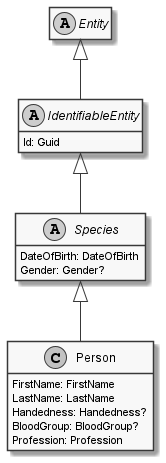

# Person

## Generally

|||
|:-|:-|
|Description|An simplified person with an firstname, lastname, birthday and some other optional properties.|
|Namespace|DoofesZeug.Models.Specieses.Human|
|BaseClass|Species|

## Properties

### Declared

|Name|Type|Read|Write|DefaultValue|
|:---|:---|:--:|:---:|:-----------|
|FirstName|[FirstName](../../Models/DoofesZeug.Models.Specieses.Human/FirstName.md)|&#x2713;|&#x2713;|NULL|
|LastName|[LastName](../../Models/DoofesZeug.Models.Specieses.Human/LastName.md)|&#x2713;|&#x2713;|NULL|
|DateOfBirth|[DateOfBirth](../../Models/DoofesZeug.Models.DateAndTime/DateOfBirth.md)|&#x2713;|&#x2713;|NULL|
|Gender|Nullable`1|&#x2713;|&#x2713;|NULL|
|Handedness|Nullable`1|&#x2713;|&#x2713;|NULL|
|BloodGroup|Nullable`1|&#x2713;|&#x2713;|NULL|
|Profession|[Profession](../../Models/DoofesZeug.Models.Specieses.Human.Professions/Profession.md)|&#x2713;|&#x2713;|NULL|

### Inherited

|Name|Type|Read|Write|DefaultValue|
|:---|:---|:--:|:---:|:-----------|
|Id|Guid|&#x2713;|&#x2713;|1d0b3a18-9d93-4371-b30d-c1bf33b008d9|

## Attributes

- Description
- Builder

## UML Diagram



## JSON Example

```json
{
  "FirstName": "John",
  "LastName": "Doe",
  "DateOfBirth": "27.09.1974",
  "Gender": "Male",
  "Handedness": "Left",
  "BloodGroup": null,
  "Profession": {
    "Id": "34b2a541-8736-4849-87f1-61e8e770852c",
    "WellKnownProfessionType": "FireFighter",
    "Since": "11.11.1942"
  },
  "Id": "af1ce801-ead3-448e-8309-f310d7cdcc51"
}
```

