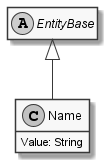

# Name

## Generally

|||
|:-|:-|
|Description|An generic name for any species.|
|Namespace|DoofesZeug.Models.Specieses|
|BaseClass|EntityBase|

## Properties

### Declared

|Name|Type|Read|Write|DefaultValue|
|:---|:---|:--:|:---:|:-----------|
|Value|String|&#x2713;|&#x2713;|NULL|

### Inherited

|Name|Type|Read|Write|DefaultValue|
|:---|:---|:--:|:---:|:-----------|

## Attributes

- Description

## UML Diagram



## JSON Example

```json
"HurzFurz"
```

