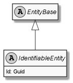

# IdentifiableEntity

## Generally

|||
|:-|:-|
|Namespace|DoofesZeug.Models|
|BaseClass|EntityBase|

## Fields

### Declared

|Name|Type|Read|Write|DefaultValue|
|:---|:---|:--:|:---:|:-----------|
|Id|Guid|&#x2713;|&#x2713;||

### Inherited

|Name|Type|Read|Write|DefaultValue|
|:---|:---|:--:|:---:|:-----------|

## Attributes

## Diagram

## Example

